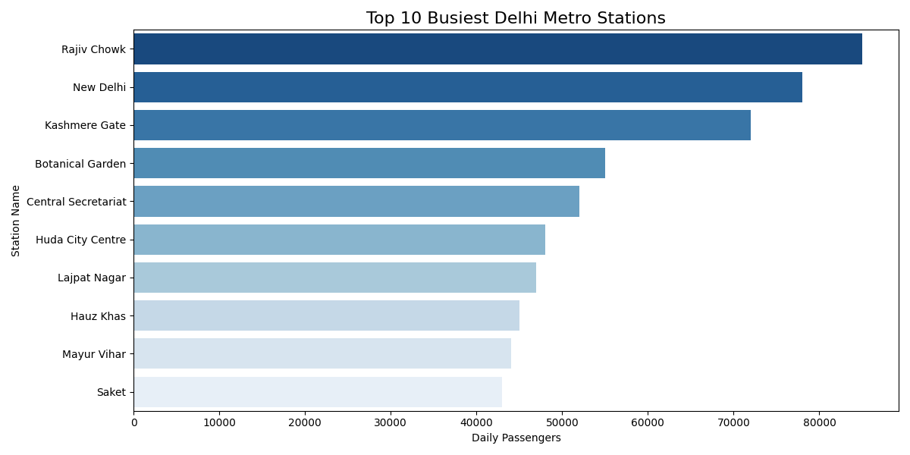
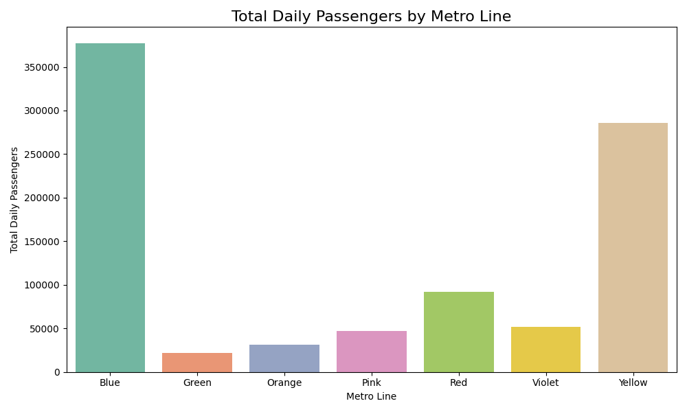
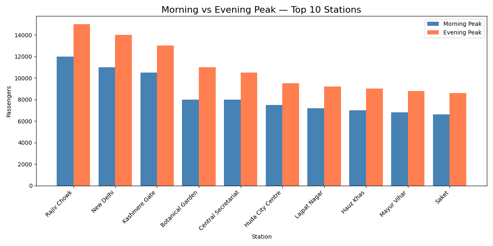
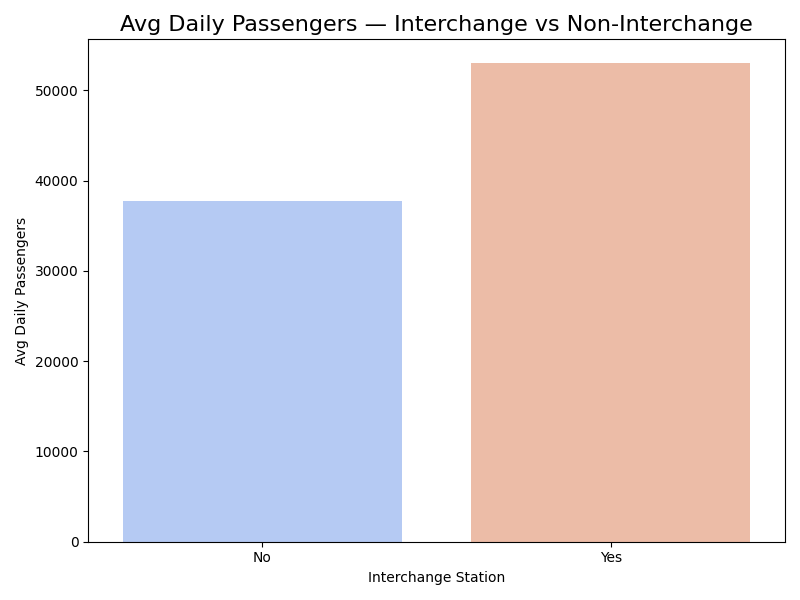

🚇 Delhi Metro Analysis

## Project Overview
Exploratory Data Analysis (EDA) on Delhi Metro network to uncover passenger traffic patterns, station-wise performance, and line-wise trends using Python and Power BI.

## 🎯 Objectives
- Analyze peak vs off-peak passenger traffic
- Identify busiest stations and lines
- Visualize route-wise performance
- Generate actionable insights for metro operations

## 🛠️ Tech Stack
- Python (Pandas, Matplotlib, Seaborn)
- Power BI (Dashboard)
- SQL (Data Querying)
- GitHub (Version Control)

## 📊 Key Insights
- Top 5 busiest stations identified
- Blue Line carries highest passenger load
- Morning peak: 8AM-10AM | Evening peak: 5PM-8PM
- Weekend traffic 30% lower than weekdays

## 📁 Project Structure
```
delhi-metro-analysis/
│
├── delhi_metro_analysis.py   # Main analysis code
├── delhi_metro_data.csv      # Dataset
└── README.md                 # Project documentation
```

## 🔗 Connect
- LinkedIn: linkedin.com/in/harsh-pandey-395a10237
- Email: harshpandey6012@gmail.com
```

---

 ## 📸 Visualizations








